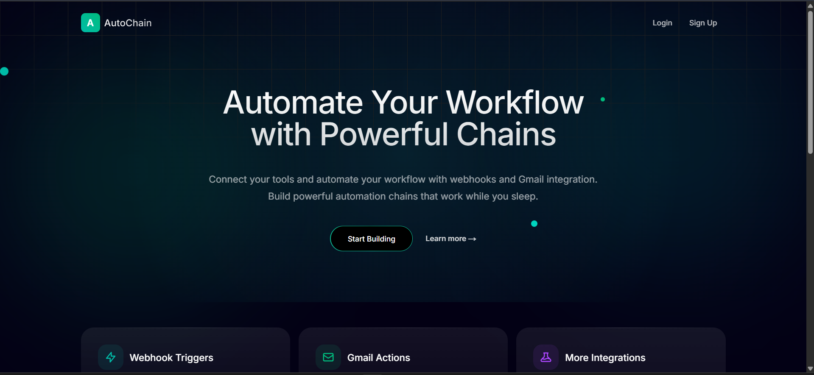
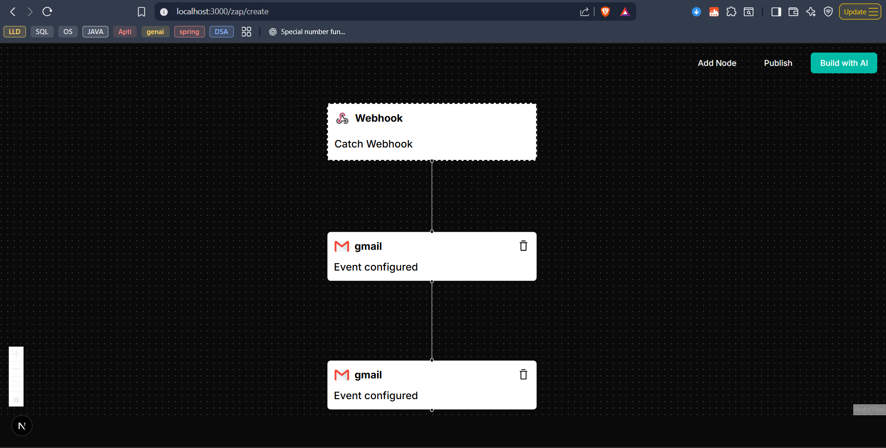
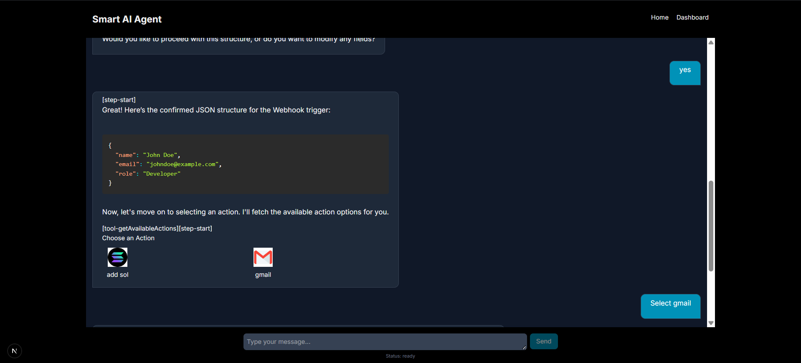

# AutoChain - AI Powered Workflow Automation Platform

A workflow automation platform that allows users to create automated workflows (Zaps) by connecting different services and triggers.


## ✨ Features

### Authentication & User Management
- Email-based signup/signin
- OTP verification
- Forgot password flow
- JWT-based authentication with refresh tokens
- Cookie-based session management

### Workflow Builder 
- Visual workflow editor using React Flow 
- Drag-and-drop interface
- Real-time validation
- Save and edit workflows

### AI Assistant
- Built with AI SDK (@ai-sdk/react, @ai-sdk/openai)
- Natural language workflow creation
- Smart suggestions for actions
- Context-aware help
- Markdown rendering with syntax highlighting

### Email Features
- Custom email templates
- OTP delivery
- Transactional emails
- Email verification


## 🚀 Tech Stack
### Frontend
- **Next.js 15.4** - React framework with App Router
- **React 19.1** - UI library
- **TypeScript** - Type safety
- **Tailwind CSS** - Styling
- **AI SDK (@ai-sdk/react, @ai-sdk/openai)** - AI-powered chat interface
- **@xyflow/react** - Interactive node-based workflow editor
- **Radix UI** - Accessible UI primitives
- **Zustand** - State management
- **React Hook Form** with Zod - Form handling and validation
- **React Markdown** - Markdown rendering with syntax highlighting

### Backend
- **Express 5.1** - Node.js web framework
- **TypeScript** - Type safety
- **Prisma** - Type-safe ORM with PostgreSQL
- **JWT** - Authentication with jsonwebtoken
- **bcrypt** - Password hashing
- **Cookie Parser** - HTTP cookie parsing
- **CORS** - Cross-origin resource sharing

### Development & Build Tools
- **Turborepo** - Monorepo build system
- **Node.js >=18** - Runtime environment
- **npm 10.9.2** - Package manager
- **ESLint & Prettier** - Code quality and formatting

## 📦 Project Structure

This is a monorepo managed with Turborepo:

```
apps/
  ├── frontend/          # Next.js web application
  ├── primary-backend/   # Main API server
  ├── processor/         # Event processor service
  ├── worker/           # Background job worker
  └── hooks/            # Shared React hooks

packages/
  ├── database/         # Prisma schema and migrations
  ├── http-status/      # HTTP status codes and messages
  ├── mailer-config/    # Email templates and config
  ├── zod-schemas/      # Shared validation schemas
  └── ui/              # Shared UI components
```


## Screenshots



   


## 🛣️ API Routes

### User Routes
```
POST /api/user/signup         # Create new account
POST /api/user/signin        # Login
POST /api/user/signout       # Logout
POST /api/user/refresh-token # Refresh access token
POST /api/user/forgot-password # Generate reset OTP
POST /api/user/verify-email  # Email verification
```

### Zap Routes
```
POST /api/zap               # Create new zap
GET /api/zap               # List all zaps
GET /api/zap/:zapId        # Get single zap
DELETE /api/zap/:zapId     # Delete zap
```

### Trigger & Action Routes
```
GET /api/trigger/available  # List available triggers
GET /api/action/available  # List available actions
```

## 🚧 Future Enhancements

1. **Form Builder**
   - Custom form creation
   - Form analytics
   - Multiple form templates

2. **Advanced AI Actions**
   - Text analysis
   - Image processing
   - Natural language processing
   - Custom model integration

3. **Event Processing**
   - Kafka integration
   - Transaction Outbox pattern
   - Async job processing
   - Event replay capability

## 🛠️ Development

1. Clone the repository
```bash
git clone https://github.com/Atif-27/AutoChain
```

2. Install dependencies
```bash
npm install
```

3. Set up environment variables
```bash
cp .env.example .env
```

4. Start development servers
```bash
npm run dev
```

## 📝 License

MIT

---

Built with ❤️ using modern web technologies